# Jenkins

## Jenkins 2.313설치

1. **wget을 통한 Jenkins 설치 (/root에서)**
   
    ```
    wget [https://get.jenkins.io/war-stable/2.303.1/jenkins.war](https://get.jenkins.io/war-stable/2.303.1/jenkins.war)
    ```
    
                                                                         (Jenkins 홈페이지 [https://www.jenkins.io/download/](https://www.jenkins.io/download/))
    
1. **jenkins.war을 tomcat/webapps로 이동**
   
    ```
    mv jenkins.war /usr/local/douzone/tomcat/webapps/
    ```
    
1. **jenkins 기본 실행 화면**
   
    ```
    url : 127.0.0.1/jenkins 검색
    ```
    
    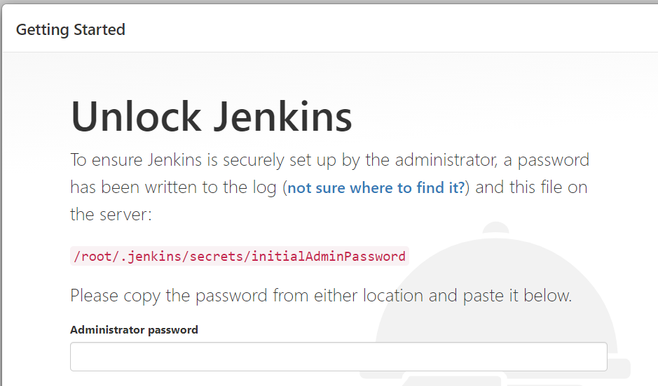
    
1. **Jenkins Unlock & 추천 플로그인 설치**
   
    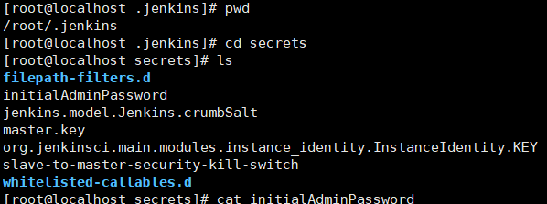
    
    - 해당 디렉토리에서 initialAdminPassword에 숨겨져있다. cat을 통해 암호 확인 가능 → jenkins 기본 실행 화면에 암호 입력 → install 선택
    
    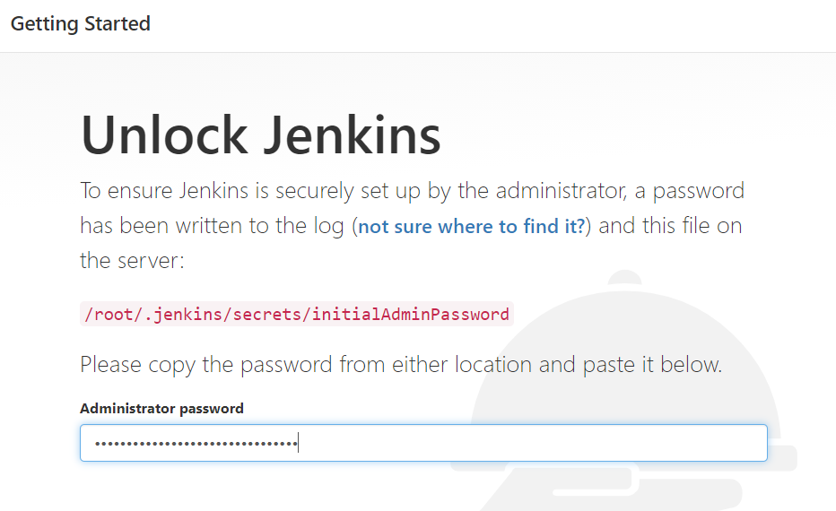
    
    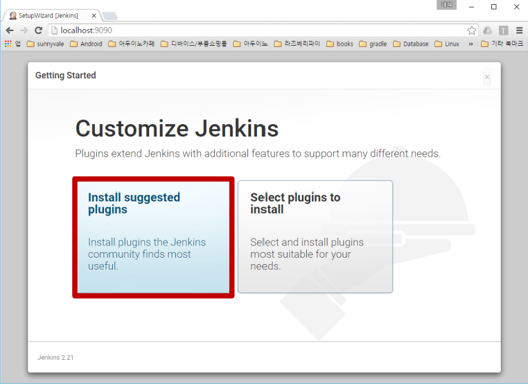
    
2. **회원 가입**
   
    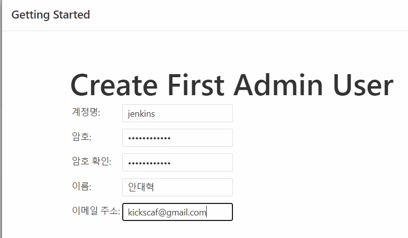
    
3. **Jenkins JDK & git & maven 설정**
   
    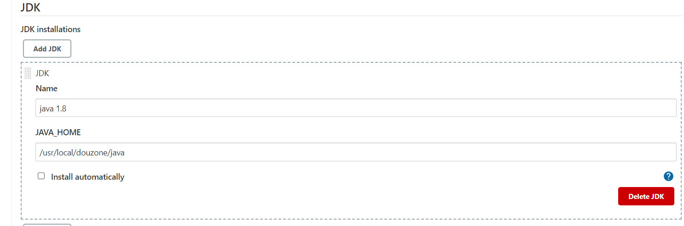
    
    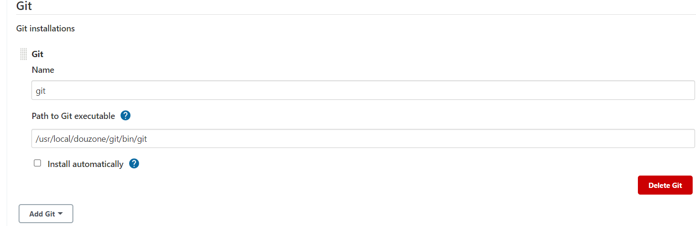
    
    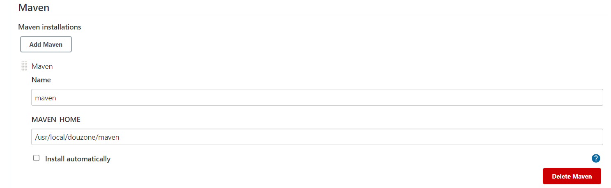
    
1. **새 프로젝트 생성**
   
    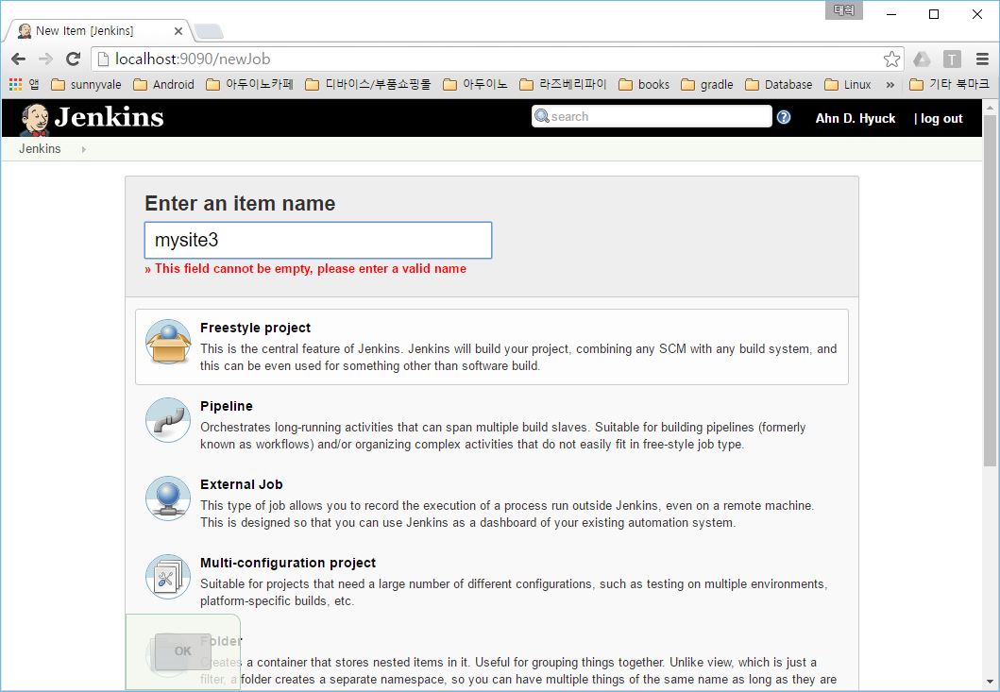
    
1. 새 프로젝트 셋팅
    - 해당 github repository URL을 입력해준다.
      
        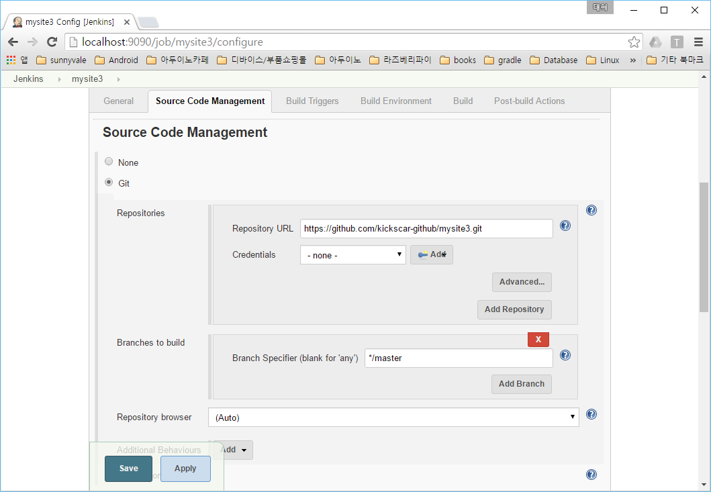
        
    - build
      
        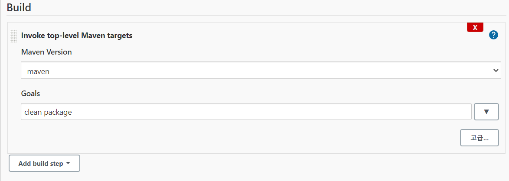
        
    
    1. **build 하기**
    
    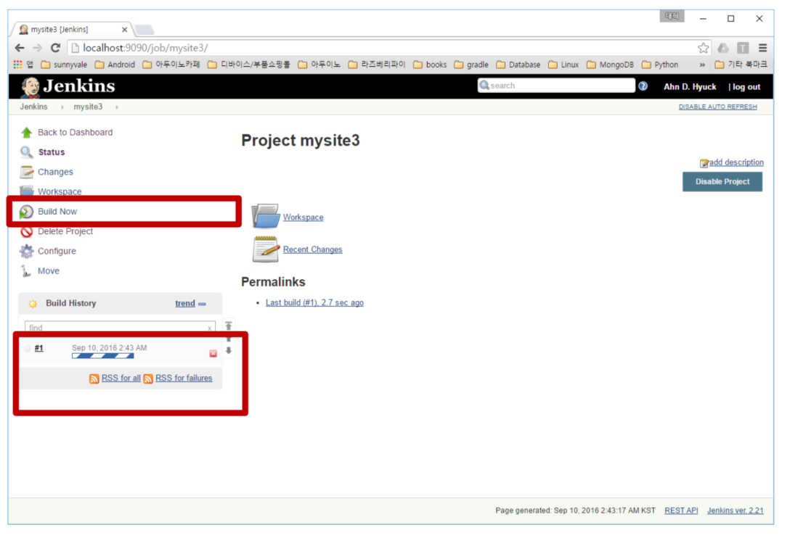
    
    - Build Now를 통해 build를 할 수 있으며,  왼쪽 아래에서 실행 결과를 확인할 수 있다.
    - Jenkins에서 빌드 기록과 현재 상태 등을 알 수 있따.