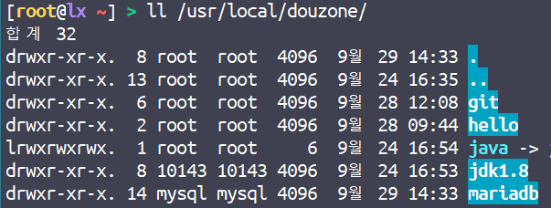

# mariadb 설치

---

---

## 1. 설치

---

### 작업 디렉토리 설정

---

```bash
cd ~
```


### 의존 라이브러리 설치

---

```bash
yum install -y gcc
yum install -y gcc-c++
yum install -y libtermcap-devel
yum install -y gdbm-devel
yum install -y zlib*
yum install -y libxml*
yum install -y freetype*
yum install -y libpng* 
yum install -y flex
yum install -y gmp
yum install -y ncurses-devel
yum install -y cmake.x86_64
yum install -y libaio
```

```bash
// 현재 디렉토리 /root
wget https://ftp.gnu.org/pub/gnu/libiconv/libiconv-1.16.tar.gz
tar xvfz libiconv-1.16.tar.gz

cd libiconv-1.16

// config 설정
./configure --prefix=/usr/local

make
make install
```

iconv 소스 컴파일 설치를 한다.


### 소스 다운로드

---

```bash

// 현재 디렉토리 /root
wget [https://downloads.mariadb.org/interstitial/mariadb-10.1.48/source/mariadb-10.1.48.tar.gz/from/https%3A//archive.mariadb.org/](https://downloads.mariadb.org/interstitial/mariadb-10.1.48/source/mariadb-10.1.48.tar.gz/from/https%3A//archive.mariadb.org/)

```


### 압축 풀기

---

```bash
mv index.html mariadb-10.1.48.tar.gz
tar xvfz mariadb-10.1.48.tar.gz
```


### 소스 이동

---

```bash
cd mariadb-10.1.48
```


### 빌드 환경 설정

---

```bash
cmake -DCMAKE_INSTALL_PREFIX=/usr/local/douzone/mariadb 
-DMYSQL_USER=mysql 
-DMYSQL_TCP_PORT=3306 
-DMYSQL_DATADIR=/usr/local/douzone/mariadb/data 
-DMYSQL_UNIX_ADDR=/usr/local/douzone/mariadb/tmp/mariadb.sock 
-DINSTALL_SYSCONFDIR=/usr/local/douzone/mariadb/etc 
-DINSTALL_SYSCONF2DIR=/usr/local/douzone/mariadb/etc/my.cnf.d 
-DDEFAULT_CHARSET=utf8 
-DDEFAULT_COLLATION=utf8_general_ci 
-DWITH_EXTRA_CHARSETS=all 
-DWITH_ARIA_STORAGE_ENGINE=1 
-DWITH_XTRADB_STORAGE_ENGINE=1 
-DWITH_ARCHIVE_STORAGE_ENGINE=1 
-DWITH_INNOBASE_STORAGE_ENGINE=1 
-DWITH_PARTITION_STORAGE_ENGINE=1 
-DWITH_BLACKHOLE_STORAGE_ENGINE=1 
-DWITH_FEDERATEDX_STORAGE_ENGINE=1 
-DWITH_PERFSCHEMA_STORAGE_ENGINE=1 
-DWITH_READLINE=1 
-DWITH_SSL=bundled 
-DWITH_ZLIB=system
```

각 라인은 옵션이므로 띄어쓰기 주의

cmake 라는 한 줄의 명령어이다

옵션을 잘못 줬을 경우 현재디렉토리(mariadb-10.1.48)를 삭제 후 다시 압축해제 해서 cmake 명령을 실행시켜주면 된다


### 빌드

---

```bash
make
```

시간이 굉장히 오래 걸린다


### 설치

---

```bash
make install
```


### 계정 생성

---

```bash
// 현재 디렉토리 /root
groupadd mysql
useradd -M -g mysql mysql
```

그룹 및 계정 생성


### 인스톨 디렉토리 /mariadb 소유자 변경

---

```bash
chown -R mysql:mysql /usr/local/douzone/mariadb
```



      maria 디렉토리의 소유자가 mysql로 바뀌었는지 확인 


### 설정파일 위치 변경

---

```bash
cp -R /usr/local/douzone/mariadb/etc/my.cnf.d /etc
```


### 기본(관리) 데이터베이스(mysql) 생성

---

```bash
/usr/local/douzone/mariadb/scripts/mysql_install_db 
--user=mysql 
--basedir=/usr/local/douzone/mariadb 
--defaults-file=/usr/local/douzone/mariadb/etc/my.cnf 
--datadir=/usr/local/douzone/mariadb/data
```

한줄의 명령어이다

쉘에 붙여 넣기할 땐 한줄로 만들어 붙여넣기 한다


### 서버 구동

---

```bash
/usr/local/douzone/mariadb/bin/mysqld_safe &
```

&을 붙여 줌으로써 백그라운드로 실행한다

ps -ef | grep mysql로 서버가 구동 되었는지 확인한다


### root 패스워드 설정

---

```bash
/usr/local/douzone/mariadb/bin/mysqladmin -u root password
```


### 데이터베이스 접속 테스트

---

```bash
/usr/local/douzone/mariadb/bin/mysql -u root -p
```

-u는 id

-p는 passwd로 대화식으로 프롬프트로 입력받는다


### path 설정(/etc/profile)

---

```bash
# mysql
export PATH=$PATH:/usr/local/douzone/mariadb/bin
```

/etc/profile 에 위의 코드를 입력하여 저장 후 source /etc/profile로 반영한다

환경변수 설정 후엔 mysql -p 로 실행이 가능하다


### 서비스(데몬, Daemon) 등록/시작/중지

---

```bash
// mysql.server 파일을 /etc/init.d/ 디렉토리 밑에 mariadb로 생성
cp /usr/local/douzone/mariadb/support-files/mysql.server /etc/init.d/mariadb
// mariadb 서비스 enable
chkconfig mariadb on (centos7이상: systemctl enable mariadb)
// mariadb 서비스 start
systemctl start mariadb

sync

// mariadb 서비스 stop
systemctl stop mariadb
```

서버가 켜져 있든 꺼져있든 서버를 재시작(reboot) 해도 서비스가 등록 되어 있기 때문에 mariadb 서버가 자동으로 구동된다