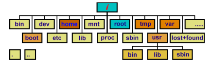

# Linux 내부구조

## 파일 시스템

- 운영 체제에서는 커널 이미지, 시스템 실행과 관련된 시스템 파일 그리고 유틸리티 파일 등을 제공한다.

- 사용자의 데이터의 저장을 위해서 사용 되며, 파일 시스템을 통해 이러한 파일들을 관리된다.

  

## 리눅스 디렉터리 구조

- 리눅스 배포판들은 FHS 표준에 따르도록 권장되어있으며, 대부분의 리눅스는 이 표준을 준수하고 있음.

### /루트

- 루트 디렉터리는 시스템의 근간이 되는 가장 중요한 디렉터리이다. 모든 파티션, 디렉터리는 루트 디렉터리 아래에 위치하기 때문에 반드시 존재해야 한다.

### /bin

- 시스템 관리자 혹은 일반 사용자가 실행할 수 있는 수많은 명령어들이 들어있다.

### /home

- 유저들의 홈 디렉터리가 하위 디렉터리로 존재하게 된다.

### /etc

- 시스템 혹은 각종 프로그램들의 환경 설정 파일들이 위치한다. 시스템 관리에서는 이곳의 파일들을 주로 수정하게 된다. 따라서 이 곳의 설정 파일들은 백업을 해 두는 것이 좋다.

## 프로세스

- 유닉스는 시분할 시스템으로 여러 개의 프로그램을 동시에 실행한다.(멀티태스킹)
- 컴퓨터 내에서 실행 중인 프로그램을 프로세스(process) 또는 태스크(Task)라고 한다.
  
    
    
- 리눅스에서는 프로세스에 대한 정보는 task_struct 구조체를 통해 관리된다.
- 이 정보는 ps 명령을 통해 가져올 수 있다.
- 실행되는 프로세스에 대한 정보는 /proc 디렉터리를 통해서 확인할 수 있다.

### /proc

- 실행중인 프로세스 정보와 CPU, 메모리 등의 시스템 정보가 가상 파일로 저장되어 있다. 대부분 읽기 전용이나 일부 파일 중에는 쓰기가 가능한 파일들이 있는 데 이런 파일들은 커널의 기능을 변경할 수 있다.

### PS

- 현재 실행되고 있는 프로세스의 목록을 보여준다.
- 사용법 : ps [옵션]
- USER: 프로세스 소유자의 계정
- PID: 프로세스를 구분하는 프로세스 아이디
- PPID:  부모 프로세스
- PID STIME: 프로세스 시작 시간
- TTY: 프로세스의 표준 입출력을 담당하는 터미널  TIME: 프로세스의
- CPU 점유시간
- CMD: 실행 명령어

### top

- 프로세스의 CPU, Memory 사용량 등 전반적인 상황을 실시간으로 모니터링한다.
- 사용법 : top [옵션]
- PR : Priority의 약자 / NI : Nice Renice
  
           0 ~ 139
            
           0 ~ 99(rt) 100 ~ 139
            
                           -20 ~ 19       renice -20 -p 45678
            
                                 +
            
                          20(기본값) + NI해서 보통
            
                  0 ~ 39가 나온다

- top의 계산법, 0에 가까울수록 우선순위가 높다.
- M: 메모리 사용량 순으로 정렬
- P: CPU 사용량 순으로 정렬
- T:  실행시간이 긴 순서로 정렬
- R: 정렬의 순서 변경

### kill

- 지정한 프로세스에서 시그널을 보낸다
- 사용법 [옵션] PID
  
    
    

### free

- 시스템의 메모리 정보를 출력한다
- 사용법 : free [옵션]