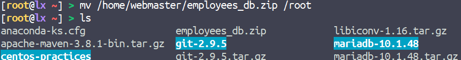

# SQL

## 1. 간단한 단축키

Ctrl + Enter : 커서에 위치하는 쿼리 실행 (멀티 쿼리일 경우 ; 부호로 구분해줘야 한다)

Ctrl + Shift + Enter : 실행하고자 하는 쿼리를 드래그 한 후 단축키를 누르면 멀티로 쿼리가 실행된다

Ctrl + B (Beauty) : 쿼리 코드를 예쁘게 정리해준다

Ctrl + / : 쿼리에 주석을 단다

Ctrl + T : 새로운 쿼리 탭 생성한다

Ctrl + Tab : 다음 쿼리 탭으로 이동한다

Ctrl + Shift Tab : 이전 쿼리 탭으로 이동한다


## 2. 예제 연습

```sql
-- 테이블 생성 
CREATE TABLE pet (
    name VARCHAR(20),
    owner VARCHAR(20),
    species VARCHAR(20),
    gender CHAR(1),
    birth DATE,
    death DATE
);
```

```sql
-- scheme 확인
desc pet;
```

```sql
-- 테이블 삭제
drop table pet;
```

```sql
-- 테이블 조회
SELECT 
    name, owner, species, gender, birth, death
FROM
    pet;
```

```sql
-- insert
insert
	into pet value('성탄이', '안대혁', 'dog', 'm', '2018-12-25', null);
```

```sql
-- 데이터 삭제(delete)
DELETE FROM pet 
WHERE
    name = '성탄이';
```


DELETE 실행이 안될 경우 위 사진의 Safe Updates 옵션 체크 해제


```sql
-- load data local info
load data local infile 'c:\\pet.txt' into table pet;
```


쿼리 실행 시 에러가 뜰 경우 위의 Others 에 OPT_LOCAL_INFILE=1 을 추가한다


```sql
-- update death
UPDATE pet 
SET 
    death = NULL
WHERE
    name != 'Bowser';
```


조회 연습1 : where

```sql
-- 1990년 이후에 태어난 아이들은?
select name, species, birth
from pet
where birth > '1990-12-31';
```


```sql
-- Gwen과 함께 사는 아이들은?
SELECT 
    name, species, owner
FROM
    pet
WHERE
    owner = 'Gwen';
```


```sql
-- null 다루기 1
SELECT 
    name
FROM
    pet
WHERE
    death IS NULL;
```


```sql
-- null 다루기 2 : 죽은 애들은?
SELECT 
    name
FROM
    pet
WHERE
    death IS NOT NULL;
```


```sql
-- like 검색(패턴 매칭) : 이름이 b로 시작하는 아이들은?
SELECT 
    name
FROM
    pet
WHERE
    name LIKE 'b%';
```


```sql
-- like 검색(패턴 매칭) : 이름이 b로 시작하는 아이들중에 이름이 6자인 아이는?
SELECT 
    name
FROM
    pet
WHERE
    name LIKE 'b_____';
```


```sql
-- 집계 (통계) 함수
SELECT count(*) FROM pet;
```


```sql
SELECT count(death) FROM pet;
SELECT count(*) FROM pet WHERE death IS NOT NULL;
```

두 쿼리의 의미와 결과는 같다


## 3. HR 계정 만들기


windows의 `employees_db.zip` 파일을 `C:\`로 옮긴다


로컬 쉘에서 현재 디렉토리를  `C:\` 로 옮긴다


`sftp webmaster@127.0.0.1`을 입력 후 접속

로컬 디렉토리는 `C:\`  


`/home/webmaster` 디렉토리에서 `put employees_db.zip` 입력하여 파일 전송

로컬(`C:\`) → 서버(`/home/webmaster`)로 파일이 이동했다




 옮긴 파일을 루트 계정의 홈디렉터리로 옮긴다


`/root` 에서 압축해제 한다


`emplyees_db` 디렉터리가 생긴다


mysql 을 root 계정으로 실행한다(`-u root` 옵션 없으면 root 계정을 의미)

`employees`라는 database를 만든다

이름은 `hr` 주소는 `10.0.2.2` 비밀번호는 `hr` 인 유저 계정을 생성한다

`employees` database의 모든 스키마에 대한 모든 권한을 `hr@10.0.2.2` 계정에게 부여한다(grant)

`flush privileges`로 변경사항(grant 명령어)을 반영한다


workbench에서 MySQL Connection을 추가한다

Connection Name : 구분을 위한 Name

PORT : mysql을 초기 설정할 때 사용한 포트번호(일반적으로 3306번)

Username : mysql에서 생성한 유저 계정의 이름 `hr`

Password : 마찬가지로 `hr`

Default Schema : employees

설정이 다 되었다면 밑의 Test Connection 버튼을 눌러 확인 후 OK 버튼 클릭


```bash
// ~/employees_db
mysql -p < employees.sql
```

mysql이 실행되면서 `~/employees_db/employees.sql` 파일에 있는 쿼리문들이 실행된다

아래 사진의 쿼리문들에는 테이블 생성 등이 있다


```sql
SELECT 
    COUNT(*)
FROM
    employees;
```

workbench의 HR Connection에서 확인

