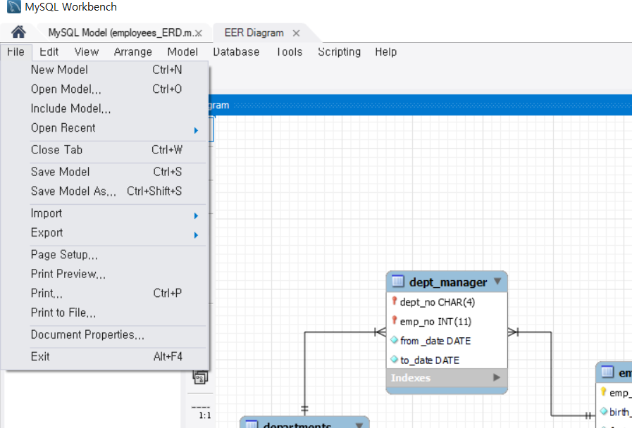

# ERD & SELECT 연습

## 1. ERD Diagram 설정


workbench의 상단 탭 Database에서 Reverse Engineer(Ctrl + R)를 클릭한다

Stored Connection을 HR로 선택하고 next 클릭한다


employees 스키마를 선택한다


employees 스키마의 EER Diagram이 생성된 것을 확인한다

myDB는 삭제해도 상관없다


EER Diagram 배치도




Save Model(Ctrl + S)를 클릭하여 C:\douzone2021\eclipse-workspace\mariadb-practices 폴더에 models 폴더를 생성하여 그 안에 저장한다


employees(사원)

emp_no : primary key(식별하는 키)


salaries(월급)

history table이다 

employee와 1:N 관계이다


departments(부서)와 employees(사원) 테이블의 N:M 관계를 나타낸다

테이블1_테이블2 처럼 두 테이블의 관계를 만들 때 이름을 언더바( _ )를 사용

두 테이블의 primary key를 가져와서 그 두 키를 조합해 unique key로 사용한다

to_date는 '0000-00-00' 형식으로 날짜를 말한다

예시로 salary테이블이면 해당 날짜까지의 월급을 말할 것이다


## 2. SQL

### select 기본구문

---

```sql
SELECT 칼럼명
	FROM 테이블명
	WHERE 조건
ODER BY 칼럼명 (DESC)
```

동작 순서

1. FROM : 선택한 칼럼이 있는 테이블을 지정
2. WHERE : 조건에 맞는 row(데이터 행)를 선택한다
3. ORDER BY : 오름차순으로 정렬해준다, DESC 옵션은 선택이며 내림차순 정렬한다

WHERE와 ORDER BY는 필수 옵션은 아니다


### select 연습

```sql
select * from departments;
```


```sql
select dept_no, dept_name from departments;
```


### alias 연습(as 생략 가능)

```sql

-- 예제1 : employees 테이블에서 직원의 이름, 성별, 입사일을 출력
select first_name as '이름', 
			 gender as '성별',
       hire_date as '입사일'
	from employees;
```

각 칼럼명을 as로 별칭을 사용하여 나타낸다


```sql
-- 예제2 : employees 테이블에서 직원의 이름, 성별, 입사일을 출력 
					+ concat 함수
select concat(first_name, ' ' , last_name) as '이름', 
			gender as '성별',
            hire_date as '입사일'
	from employees;
```


### distinct

```sql
-- 예제 : title 테이블에서 모든 직급의 이름을 출력
select distinct(title) from titles
select title from titles limit 0, 3
```

distinct는 중복된 row를 제거한다

limit 옵션은 index가 0(첫번째 row)인 것부터 3개의 row를 가져온다는 뜻이다

limit를 쓰더라도 select로 데이터를 풀스캔한 다음에 3개만 보여주기에 성능은 똑같다고 보면 된다

