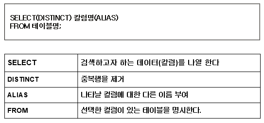

# 데이터 검색 Ⅰ

## SELECT



### limit

```jsx
select * from employees limit 0, 3;
```

- 0은 시작할 행의 위치 / 3은 출력할 갯수를 의미

  

### 함수 : 수학

- **abs (절대값)**
  
    ```jsx
    select abs(-1), abs(1);
    출력결과 : 1    1
    ```
    
- **mod(나머지)**
  
    ```jsx
    select mod(10, 3);
    출력결과 : 1
    ```
    
- **floor (버림)**
  
    ```jsx
    select floor(3.14);
    출력결과 : 3
    ```
    
- **ceil (올림)**
  
    ```jsx
    select ceil(3.14);
    select ceiling(3.14); → ceil() / ceiling() 같은 의미임
    출력결과 : 4
    ```
    
- **round(x) : x에 가장 근접한 정수**
- **round(x, d) : x 값 중에 소수점 d자리에 가장 근접한 실수**
  
    ```jsx
    select round(1.498654), round(1.498, 1), round(1.498, 0);
    출력결과 : 1    1.5    1
    ```
    
- **pow(x, y), power(x, y) x의 y승**
  
    ```jsx
    select pow(2,10), power(10, 2);
    출력결과 : 1024    100
    ```
    
- **sign(x) : x가 음수면 -1, 0이면 0, 양수면 1을 출력한다.**
  
    ```jsx
    select sign(20), sign(-100), sign(0);
    출력결과 : 1    -1    0
    ```
    
- **greatest(x, y, ........), least(x, y, ....)**
 **가장 큰것                 가장 작은 것**
   
    ```jsx
    select greatest(10, 40, 20, 30), least(10, 40, 20, 30);
    출력결과 : 40     10
    
    select greatest('b', 'A', 'C'), greatest('hello', 'hellp', 'hellq');
    출력결과 : C      hellq
    ```
   


### 함수 : 날짜 함수

- **CURDATE(), CURRENT_DATE : 오늘 날짜를 YYYY-MM-DD나 YYYYMMDD 형식으로 반환한다.**
  
    ```jsx
    select CURDATE(), CURRENT_DATE;
    출력결과 : 2021-10-01	   2021-10-01
    ```
    


- **CURTIME(), CURRENT_TIME : 현재 시각을 HH:MM:SS나 HHMMSS 형식으로 환한다.**
  
    ```jsx
    select CURTIME(), CURRENT_TIME;
    출력결과 : 19:14:14     	19:14:14
    ```
    


- **now() vs sysdate()**
  
    ```jsx
    select now(), sysdate();
    select now(), sleep(2), now();
    출력결과 :  결과가 같음
    
    select sysdate(), sleep(2), sysdate();
    출력결과 :  결과가 2초 차이가 남
    ```
    
- 
  
- **date_format(date, format) : 입력된 date를 format 형식으로 반환한다.**
  
    ```jsx
    select date_format(now(), '%Y년 %m월 %d일 %h시 %i분 %s초');
    출력결과 : 
    
    select date_format(now(), '%Y년 %c월 %d일 %h시 %i분 %s초');
    출력결과 : 
    ```
    


- **period_diff : 두 인자 개월의 수 차이를 구한다 (YYMM, YYYYMM)
  예) 근무 개월 수를 출력**

    ```jsx
    select first_name,
    period_diff(date_format(curdate(), '%Y%m'), date_format(hire_date, '%Y%m')) as month
    from employees
    order by month desc;
    ```

  

- **date_add(= adddate), data_sub(= subdate)
  날짜를 date에 type(day, month, year) 형식으로 더하거나 뺀다.
  예제) 각 사원들의 근무 년수가 5년이 되는 날은 언제인가?**

    ```jsx
    select first_name,
    hire_date,
    date_add(hire_date, interval 5 year)
    from employees;
    ```

  

- **cast (형변환)
  CAST 함수의 사용법 : CAST(expression AS type) 또는 CONVERT(expression,type)**
  
    ```jsx
    select '12345' + 10, cast('12345' as int) + 10;
    select date_format(cast('2021-10-01' as date), '%Y-%m-%d');
    select cast(1-2 as unsigned); -- unsigned(integer) :
    select cast(cast(1-2 as unsigned) as signed);
    ```
  
- **mysql type**

- **varchar, char, text, CLOB(Character Large Object)**

- **signd(unsigned), int(integer), medium int, big int, int(11)**

- **float, double**

- **time,, date, datetime**

- **LOB : CLOB, BLOB**


### 함수 : 집계쿼리**

- **select 그룹함수가 적용된 경우**
  
    ```jsx
    select avg(salary)
    from salaries;
    ```
    


- **select 절에 그룹 함수가 있는 경우, 어떤 컬럼도 select 절에 올 수 없다.**
  
    ```jsx
    select emp_no, avg(salary)
    from salaries;
    ```
    
    - emp_no는 아무 의미가 없다. -> 오류이지만 mysql에선 오류로 인식 안함.

  

- **query 실행 순서
 (1) from : 접근 테이블 확인
    (2) where : 조건에 맞는 row 선택
    (3) 집계
    (4) projection**
   
    ```jsx
    select avg(salary)
    from salaries
    where emp_no = '10060';
    ```
   
   
   
- **group by에 참여하고 있는 컬럼은 projection이 가능하다.(select 절에 올 수 있다)**
  
    ```jsx
    select emp_no, avg(salary) as avg
    from salaries
    group by emp_no
    order by avg;
    ```
    


- **having :
 집계결과(결과 임시 테이블)에서 row를 선택해야 하는 경우
    이미 where절은 실행이 되었기 때문에 having절에서 조건을 주어야 한다.**
   
    ```jsx
    select emp_no, avg(salary)
    from salaries
    group by emp_no
    having avg(salary) > 60000;
    ```