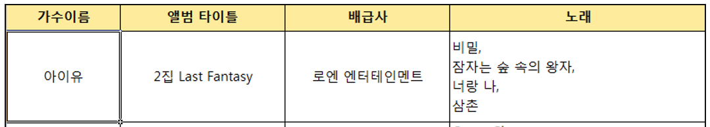

# 쿼리문 연습 및 정규화

## 1. 쿼리실습

### 서브쿼리

```sql
-- 실습문제 4 : 각 부서별로 최고 월급을 받는 직원의 이름과 월급을 출력하세요.
-- 대혁 40000
-- 둘리 50000
select a.dept_no, max(b.salary)
	from dept_emp a, salaries b
where a.emp_no = b.emp_no
	and a.to_date = '9999-01-01'
	and b.to_date = '9999-01-01'
group by a.dept_no;
```

제일 처음으로 각 부서의 최고 월급을 구한다 

이걸 서브 쿼리로 활용한다


```sql
-- solve 1 : where subquery =any(in)
select d.dept_name, c.first_name, b.salary
	from dept_emp a, salaries b, employees c, departments d
where a.emp_no = b.emp_no
	and b.emp_no = c.emp_no
	and a.dept_no = d.dept_no
	and a.to_date = '9999-01-01'
	and b.to_date = '9999-01-01'
	and (a.dept_no, b.salary) in (select a.dept_no, max(b.salary)
									from dept_emp a, salaries b
                                  where a.emp_no = b.emp_no
                                  and a.to_date = '9999-01-01'
                                  and b.to_date = '9999-01-01'
                                  group by a.dept_no);
```

where절에서 서브쿼리를 활용한 예제


```sql
-- solve 2 : from subquery
select c.first_name, b.salary
	from dept_emp a,
				salaries b,
				employees c,
				(select a.dept_no, max(b.salary) as max_salary
					from dept_emp a, salaries b
				where a.emp_no = b.emp_no
					and a.to_date = '9999-01-01'
					and b.to_date = '9999-01-01'
				group by a.dept_no) d
where a.emp_no = b.emp_no
	and b.emp_no = c.emp_no
	and a.dept_no = d.dept_no
	and a.to_date = '9999-01-01'
	and b.to_date = '9999-01-01'
	and b.salary = d.max_salary;
```

from절에서 서브쿼리를 활용한 예제


### ddl, dml 연습

```sql
create table member(
	no int(11) not null auto_increment,
	email varchar(200) not null,
	password varchar(64) not null,
	name varchar(100) not null,
	department varchar(100),
	primary key(no)
);
desc member;
```

member 테이블 생성


```sql
alter table member add juminbunho char(13) not null;
desc member;
alter table member drop juminbunho;
desc member;
alter table member add join_date datetime not null;
desc member;
alter table member change department department varchar(100) not null;
desc member;
alter table member add self_intro text;
desc member;
```

member 테이블 구조 수정


```sql
-- insert
insert
	into member
values(null, 'kickscar@gmail.com', password('1234'), '안대혁', '개발팀', now(), null);
---------------------------------------------------------------------------------------
insert
	into member(no, email, password, department, name, join_date)
values(null, 'kickscar3@gmail.com', password('1234'),  '개발팀3', '안대혁3', now());
```

데이터 삽입


```sql
-- update
update member
set email = 'kicks@gmail.com', password = password('5678')
where no = 3;
```

데이터 수정


```sql
-- delete
// 특정 데이터 삭제
delete
from member
where no = 5;

// 테이블 전체 데이터 삭제
delete from member;
```

데이터 삭제


```sql
-- drop
// 테이블 삭제
drop table member;
```

테이블 삭제


### dml과 트랜잭션

insert, update, delete는 쿼리 실행만으론 db에 반영이 안되고 commit을 해야 db에 반영이 된다

```sql
-- transaction
select @@AUTOCOMMIT;
set autocommit=0;
```

autocommit의 값을 1로 변경하면 select 쿼리를 실행할 때 자동으로 commit이 되어 앞에서 실행한 insert, update, delete 결과들이 반영된다

0일 경우엔 DML 명령어의 결과들이 commit이 안되어 select 실행 시 db에 반영되기 전 데이터들을 보여준다


## 2. 데이터베이스 모델링

### 데이터베이스 설계의 주된 목적

- 중복성 제거

- 정규화(nomaliztion)

  

### 데이터 모델

엔티티, 속성, 관계 3가지 요소로 구성

- 엔티티 ,속성 : 엔티티와 속성은 정규화를 통해 엔티티가 될 수 있고 속성이 될 수 도 있다

  

### 정규화 - 정의

정규화의 목적

- 데이터의 중복성 제거
- 갱신이상(update anomalies) 회피

데이터 모델을 좀 더 구체적으로 해준다


### 정규화 - 제 1 정규형(1NF)

하나의 엔티티의 모든 속성들이 하나의 값을 가질 때 제 1정규형이라 한다

각 속성들이 하나의 값(원자성)만을 가지는지 확인

중복된 값을 가지는 속성은 따로 빼내어 새로운 엔티티로 만든다



album 엔티티의 노래 속성은 여러 값을 가지므로 1NF에 위배된다


### 유일한 식별자

각각의 엔티티는 데이터를 구별하는 ID라고 불리는 식별자를 가진다

일명 primary key라고 부른다

ID는 다음의 규칙을 가지는 엔티티의 속성이라고 보면된다

- 엔티티의 모든 인스턴스에 유일하다
- Not Null이어야 한다
- 변하지 않는 값이어야한다