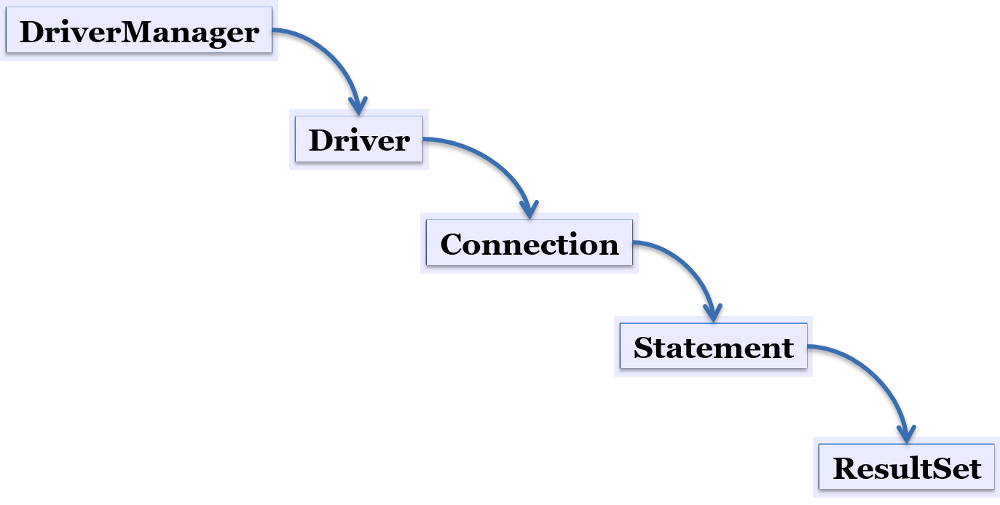

#  JDBC

## JDBC

1. JDBC(Java Database Connectivity)의 정의
자바를 이용한 데이터베이스 접속과 SQL 문장의  실행, 
그리고  실행 결과로 얻어진 데이터의 핸들링을 제공하는 방법과 절차에 관한 규약
자바 프로그램내에서 SQL문을 실행하기 위한 자바 API
SQL과 프로그래밍 언어의 통합 접근 중 한 형태

- 개발자를 위한 표준 인터페이스인 JDBC API와 데이터베이스 벤더, 
또는 기타 써드파티에서 제공하는 드라이버(driver)

- 사용 클래스(class)

2. JDBC를 이용한 데이터베이스 연결 방법
1 단계 : import java.sql.*;
2 단계 : 드라이버를 로드 한다.
3 단계 : Connection 객체를 생성한다.
4 단계 : Statement 객체를 생성 및 질의 수행
5 단계 : SQL문에 결과물이 있다면 ResultSet 객체를 생성한다.
6 단계 : 모든 객체를 닫는다.

## INSERT, UPDATE, DELETE
- stmt.executeUpdate(“query”); 

*자바클래스내 sql 작성에서 ; 세미콜론 빼야한다.

'''
package test;

import java.sql.Connection;
import java.sql.DriverManager;
import java.sql.SQLException;
import java.sql.Statement;

public class UpdateTest01 {

	public static void main(String[] args) {
		DeptVo vo = new DeptVo();
		vo.setNo(8L);
		vo.setName("전략기획팀");
		
		Boolean result = update(vo);
		if(result) {
			System.out.println("성공!");
		}
	}
	
	private static Boolean update(DeptVo vo) {
		boolean result = false;
		Connection conn = null;
		Statement stmt = null;

​		
​		try {
​			// 1. JDBC Driver 로딩
​			Class.forName("org.mariadb.jdbc.Driver");
​	
​			// 2. 연결하기
​			String url = "jdbc:mysql://127.0.0.1:3306/employees?charset=utf8"; // ?charset=utf8 옵션
​			conn = DriverManager.getConnection(url, "hr", "hr");
​			
			System.out.println("연결성공");
			
			// 3. Statement 생성
			 stmt = conn.createStatement();

​			 
​			// 4. SQL 실행
​			 String sql = "update dept set name='" + 
​					 vo.getName() + "'" + "where no=" + vo.getNo(); //; 세미콜론 빼야함
​			 int count = stmt.executeUpdate(sql);
​			
​			 result = count == 1;
​			 
		} catch (ClassNotFoundException e) {
			System.out.println("드라이버 로딩 실패:" + e);
		} catch (SQLException e) {
			System.out.println("error:" + e);
		} finally {
			// clean up
			try {
				if(stmt != null) {
					stmt.close();
				}
				if(conn != null) {
					conn.close();
				}
			} catch (SQLException e) {
				e.printStackTrace();
			}
		}
		
		return result;
	}

}
'''

-  DeptVo 클래스

'''
package test;

public class DeptVo {
	private Long no;
	private String name;
	
	public Long getNo() {
		return no;
	}
	public void setNo(Long no) {
		this.no = no;
	}
	public String getName() {
		return name;
	}
	public void setName(String name) {
		this.name = name;
	}
	
	@Override
	public String toString() {
		return "DeptVo [no=" + no + ", name=" + name + "]";
	}

}
'''

## SELECT
- stmt.executeQuery(“query”);
- SELECT는 테이블을 가져와야하므로 .executeQuery 사용

'''
package test;

import java.sql.Connection;
import java.sql.DriverManager;
import java.sql.ResultSet;
import java.sql.SQLException;
import java.sql.Statement;

public class SelectTest01 {
	public static void main(String[] args) {
		search("pat");
	}

	public static void search(String keyword) {
		Connection conn = null;
		Statement stmt = null;
		ResultSet rs = null;
	
		try {
			// 1. JDBC Driver 로딩
			Class.forName("org.mariadb.jdbc.Driver");
	
			// 2. 연결하기
			String url = "jdbc:mysql://127.0.0.1:3306/employees?charset=utf8";
			conn = DriverManager.getConnection(url, "hr", "hr");
	
			System.out.println("연결성공");
	
			// 3. Statement 생성
			stmt = conn.createStatement();
	
			// 4. SQL 실행
			String sql = "select emp_no, first_name " + 
			"from employees" + " where first_name like '%" + keyword + "%'";
																															// 세미콜론
																															// 빼야함
			rs = stmt.executeQuery(sql);
			while(rs.next()) {
				Long empNo = rs.getLong(1);
				String firstName = rs.getString(2);
				System.out.println(empNo + ":" + firstName);
			}
		} catch (ClassNotFoundException e) {
			System.out.println("드라이버 로딩 실패:" + e);
		} catch (SQLException e) {
			System.out.println("error:" + e);
		} finally {
			// clean up
			try {
				if(rs != null) {
					rs.close();
				}
				if (stmt != null) {
					stmt.close();
				}
				if (conn != null) {
					conn.close();
				}
			} catch (SQLException e) {
				e.printStackTrace();
			}
		}
	}

}
'''

