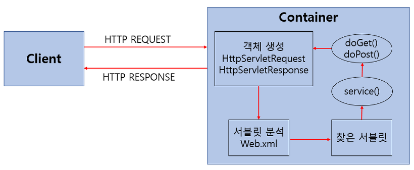

# 웹 프로그래밍

> - 서블릿 프로그래밍 : 대체로 사라지는 추세(스프링이 대체)
>
> ## 서블릿
>
> - <Strong>서블릿의 정의</Strong> : 클라이언트의 요청을 처리하고, 그 결과를 반환하는 Servlet 클래스의 구현 규칙을 지킨 자바 웹 프로그래밍 기술
> - 네트워크에서 데이터를 전달받고(이 때 포트 번호를 통해 들어옴, ex) 8080), 그걸 Dao를 통해 DB로 전달하는  <span style="color:red">중간</span>에 서블릿이 들어감
> - 중간 과정의 호출은 <Strong>톰캣(Tomcat)</Strong>을 통해서 이뤄짐
> - Tomcat(Web Application<Strong>s</Strong> Server) 구조도
>
> - 클라이언트와 서블릿의 관계
>   - httprequest랑 httpresponse로 주고받는다.
>
> 
>
> - http://127.0.0.1<Strong>/</Strong>mysite(문서의 경로)<Strong>/</Strong>book(문서 이름) 이런 식으로 슬래시를 구분으로 요청 진행
> - 서블릿에서 사용자가 URL을 입력했을 때, 해당 URL에 매칭되는 자바파일(--.java)가 실행되어야 하는데, 그를 위해 <u>url 매핑</u>을 한다.
> - get / post 등으로 받는다.
>   - get : 어떠한 정보를 가져와서 조회하기 위해서 사용되는 방식
>   - post : 데이터를 서버로 제출하여 추가 또는 수정하기 위해서 사용하는 방식
>
> - http servlet은 추상
>
> ```java
> HttpServlet servlet = new servlet.doGet(reguest, response)
> ```
>
> 
>
> - 브라우저 화면에서 링크를 누를 때마다 포트 번호를 통해 response 함
> - 같은 IP에 같은 port로 URL만 변경해서 계속해서 접근 가능
>
> ### Web Applications Server
>
> 
>
> - 문맥 : OS에서의 문맥은 프로세스(process)이다.
>
> ## MVC 패턴
>
> 
>
> 
>
> 
>
> => 컨트롤러에서 Dao로 정보를 주고받음.
>
> - **Model:** 데이터를 가진 객체, 파라미터로 자주 쓰인다. DB의 테이블과 대응하는 경우가 많다.
> - **View:** UI를 담당한다. 클라이언트 측 기술인 Html, Css, Javascript등으로 만들어진 컨테이너이다.
> - **Controller:** UI를 통한 사용자의 입력 명령에 응답하고, 및 데이터 흐름 제어를 담당한다
>
> 
>
> => 모델1 보다는 모델2를 주로 사용
>
> 

