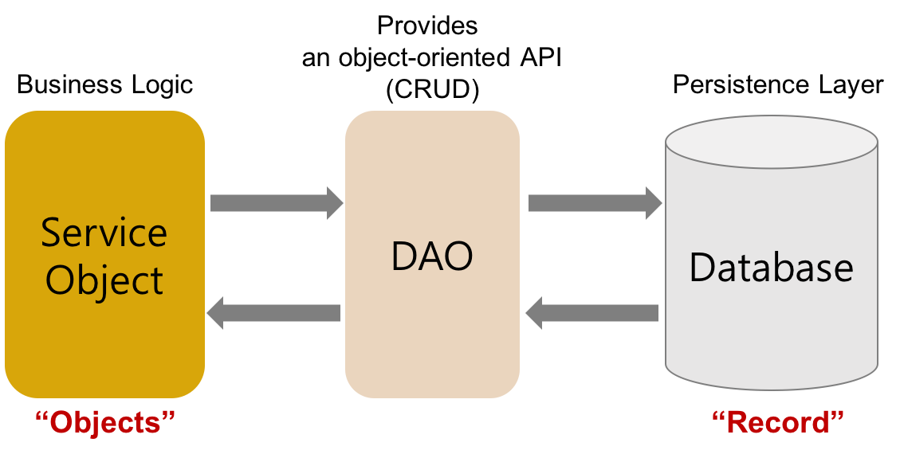
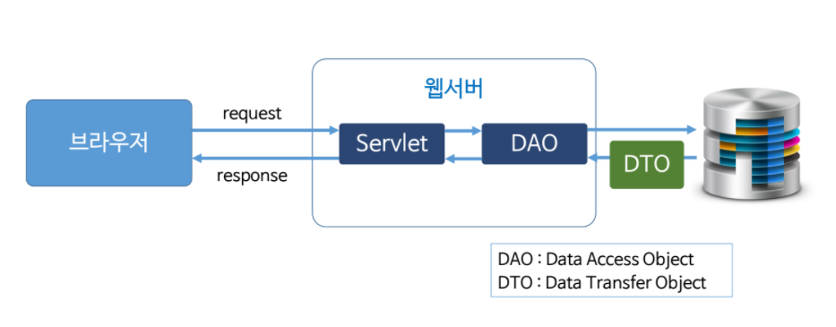

## JDBC programming

**DAO(Data Access Object)**

DB를 사용해 데이터를 조회하거나 조작하는 기능을 전담하도록 만든 오브젝트

**Database의 data에 접근하기 위한 객체**

DataBase에 접근하기 위한 로직과 비즈니스 로직을 분리하기 위해 사용한다.

- DAO 구성

**1.자바와 데이터베이스를 연결하기 위한 DRIVER**

**2. 데이터 베이스가 있는 위치를 담을 URL**

**3. 데이터 베이스 접근을 위한 USER ID**

**4. 그 USER의 PASSWORD**

- DAO 코드 구조

**1. Class.forName() 을 이용, 드라이버 로드**

**2. DriverManager.getConnection() 으로 연결**

**3. Connection 인스턴스를 이용, Statement 객체 생성**

**4. Statement 객체의 결과를 받기**

**VO,DTO**

VO(Value Object)는 우리가 알고 있는 Getter Setter 생성자 변수가 있는 것을 말한다.

다른말로는 DTO(Data Transfer Object)라고도 한다. 이 둘은 모두 계층간 데이터 교환을 위한 자바빈즈를 말한다.

### 코드 예시

- Select 예시

'''

	package test;
	
	import java.sql.Connection;
	import java.sql.DriverManager;
	import java.sql.PreparedStatement;
	import java.sql.ResultSet;
	import java.sql.SQLException;
	
	public class SelectTest02 {
		public static void main(String[] args) {
			search("pat");
		}
	
		public static void search(String keyword) {
			Connection conn = null;
			PreparedStatement pstmt = null;
			ResultSet rs = null;
	
			try {
				// 1. JDBC Driver 로딩
				Class.forName("org.mariadb.jdbc.Driver");
	
				// 2. 연결하기
				String url = "jdbc:mysql://127.0.0.1:3306/employees?charset=utf8";
				conn = DriverManager.getConnection(url, "hr", "hr");
	
				System.out.println("연결성공");
	
				// 3. Statement 생성
				String sql = "select emp_no, first_name from employees where first_name like ?";
				pstmt = conn.prepareStatement(sql);
	
				// 4. binding
				pstmt.setString(1, "%" + keyword + "%");

​				
​				// 5. SQL 실행																								// 빼야함
​				rs = pstmt.executeQuery();
​				while(rs.next()) {
​					Long empNo = rs.getLong(1);
​					String firstName = rs.getString(2);
​					System.out.println(empNo + ":" + firstName);
​				}
​			} catch (ClassNotFoundException e) {
​				System.out.println("드라이버 로딩 실패:" + e);
​			} catch (SQLException e) {
​				System.out.println("error:" + e);
​			} finally {
​				// clean up
​				try {
​					if(rs != null) {
​						rs.close();
​					}
​					if (pstmt != null) {
​						pstmt.close();
​					}
​					if (conn != null) {
​						conn.close();
​					}
​				} catch (SQLException e) {
​					e.printStackTrace();
​				}
​			}
​		}
​	
​	}

'''

- Insert, Delete, Update예시

'''

	package test;
	
	import java.sql.Connection;
	import java.sql.DriverManager;
	import java.sql.PreparedStatement;
	import java.sql.SQLException;

	public class InsertTest02 {
	
		public static void main(String[] args) {
			insert("영업");
			insert("개발");
			insert("기획");
	
		}
	
		private static boolean insert(String name) {
			boolean result = false;
			Connection conn = null;
			PreparedStatement pstmt = null;
	
			try {
				// 1. JDBC Driver 로딩
				Class.forName("org.mariadb.jdbc.Driver");
	
				// 2. 연결하기
				String url = "jdbc:mysql://127.0.0.1:3306/employees?charset=utf8";
				conn = DriverManager.getConnection(url, "hr", "hr");
	
				System.out.println("연결성공");
	
				// 3. SQL문 준비
				String sql = "insert into dept values (null, ?)"; 
				pstmt = conn.prepareStatement(sql);
	
				// 4. 바인딩(binding)
				pstmt.setString(1, name);

​				
​				// 5. SQL 실행
​				int count = pstmt.executeUpdate();
​				
​				result = count == 1;
​	
			} catch (ClassNotFoundException e) {
				System.out.println("드라이버 로딩 실패:" + e);
			} catch (SQLException e) {
				System.out.println("error:" + e);
			} finally {
				// clean up
				try {
					if (pstmt != null) {
						pstmt.close();
					}
					if (conn != null) {
						conn.close();
					}
				} catch (SQLException e) {
					e.printStackTrace();
				}
			}
	
			return result;
	
		}
	
	}

'''

