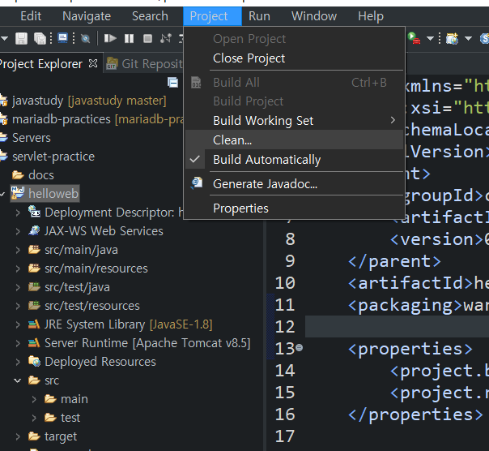

## JSP

helloweb 프로젝트 생성후(war로 생성한다)

Java EE Tools - Generate Deployment Descriptor stub

JSP 파일을 생성한다. 생성이후 오류가 잡혀있는데, 톰캣 런타임 설정을 해줘야한다.

프로젝트 폴더에 properties

톰캣 체크 후 apply

이후 project-clean로 이동

자신의 프로젝트를 선택후 clean을 누른다.

hello.JSP의 런타임이 톰캣으로 설정되면서 오류가 사라진다. 

**어플리케이션 Add**

이클립스 하단의 Servers - 마우스 오른쪽 - Add

오른쪽으로 프로젝트를 add 한다

서버실행 : 오른쪽의 재생버튼 클릭

URL을 통해 브라우저에서 .jsp 확인

## Servlet

URL을 소문자를 사용하여 간단히 재설정한다.

abstract method 에서 필요한 부분만 고르며,

Constructors from superclass 체크해제

간단한 코드작성후

재설정한 URL을 통해 브라우저에서 확인

