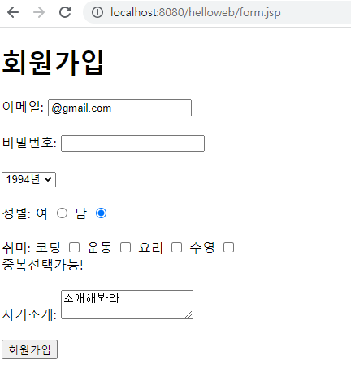
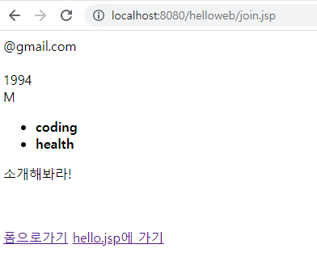
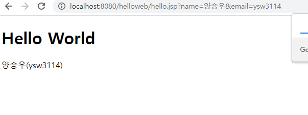
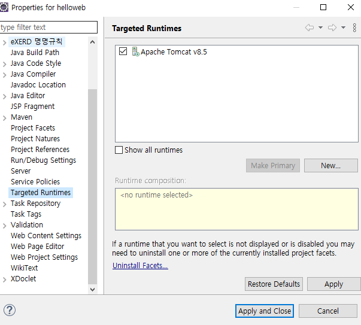
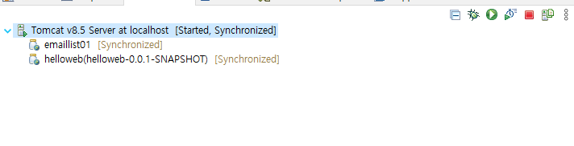
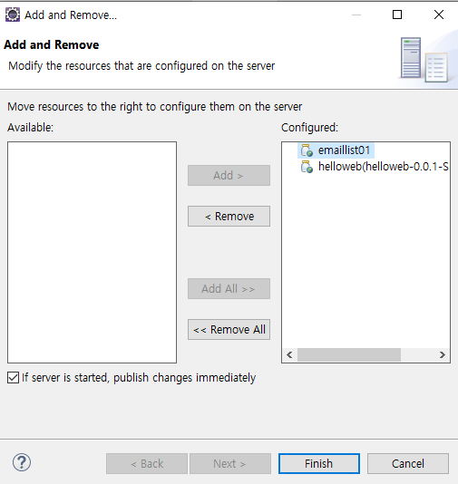

## JSP실습

##### form.jsp

```
<%@ page language="java" contentType="text/html; charset=UTF-8"
    pageEncoding="UTF-8"%>
<!DOCTYPE html>
<html>
<head>
<meta charset="UTF-8">
<title>Insert title here</title>
</head>
<body>
	<h1>회원가입</h1>
	<form action="join.jsp" method="post">
		이메일: <input type="text" name="email" value="@gmail.com"/>
		<br/><br/>
		비밀번호: <input type="password" name="password" value=""/>
		<br/><br/>
		
		<select name="birthYear">
			<option value="1994">1994년</option>
			<option value="1995">1995년</option>
			<option value="1996">1996년</option>
		</select>
		<br/><br/>
		성별:
		여 <input type="radio" name="gender" value="f"/>
		남 <input type="radio" name="gender" value="M" checked='checked'/>
		<br/><br/>
		
		취미:
		코딩 <input type="checkbox" name="hobby" value="coding"/>
		운동 <input type="checkbox" name="hobby" value="health"/>
		요리 <input type="checkbox" name="hobby" value="cooking"/>
		수영 <input type="checkbox" name="hobby" value="swimming"/>
		<br/>중복선택가능!
		<br/><br/>
		
		자기소개:
		<textarea name="profile">소개해봐라!
		</textarea>
		<br/><br/>
		
		
		<input type="submit" value="회원가입"/>
	</form>
</body>
</html>
```

> 버튼으로 넘어가는 페이지는 action="" 으로 명시할수 있다.
>
> checkbox타입은 여러개 선택가능, radio타입은 하나만 선택





##### join.jsp

```
<%@ page language="java" contentType="text/html; charset=UTF-8"
    pageEncoding="UTF-8"%>
    
<%
request.setCharacterEncoding("utf-8");

String email = request.getParameter("email");
String password = request.getParameter("password");
String birthYear = request.getParameter("birthYear");
String gender = request.getParameter("gender");
String[] hobbies = request.getParameterValues("hobby");
String profile = request.getParameter("profile");
%> <!-- 자바영역 -->
    
<!DOCTYPE html>
<html>
<head>
<meta charset="UTF-8">
<title>Insert title here</title>
</head>
<body>
	<%=email  %><br/>
	<%=password %><br/>
	<%=birthYear %><br/>
	<%=gender %><br/>
	
	<ul> 
	<%
		for(String hobby: hobbies){
	%>
		<li>
		<strong><%=hobby %></strong>
		</li>
	<%
		}
	%>
	</ul>
	
	<p>
	<%=profile.replaceAll("\n", "<br/>") %>
	</p>
	
	<br/><br/>
	<a href="form.jsp"> 폼으로가기</a>
	<a href="/helloweb/hello.jsp?name=양승우&email=ysw3114"> hello.jsp에 가기</a>
</body>
</html>
```

> a href -> 문서내 이동이 가능
>
> <%
> request.setCharacterEncoding("utf-8");
>
> String email = request.getParameter("email");
> String password = request.getParameter("password");
> String birthYear = request.getParameter("birthYear");
> String gender = request.getParameter("gender");
> String[] hobbies = request.getParameterValues("hobby");
> String profile = request.getParameter("profile");
> %>   // HTML문서내의 자바 영역
>
> 
>
> <a href="/helloweb/hello.jsp?name=양승우&email=ysw3114"> hello.jsp에 가기</a> -> 클릭시 작성한name값과 email 값이 hello.jsp페이지로 넘어간다.



##### hello.jsp에 가기를 눌렀을때 나오는 페이지



##### 서버 연동을 위해서는 프로젝트의 설정에서 런타임을 적용시켜줘야한다.




##### 초록색 재생버튼을 통해 서버를 실행할수 있고



##### Add and Remove 설정을 통해 불필요한 서버실행을 위해 필요한 프로젝트만 Add 및 Remove를 통해 관리한다.



