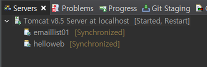

# tag, emaillist

## emaillist maven project 만들기

### 프로젝트 생성
servlet-practices 프로젝트 밑에 emaillist01이름의 maven module project를 만든다

src/main/webappdp에 강의자료(emaillist의 index.jsp, form.jsp)를 넣는다


### web.xml

WEB-INF를 생성하기 위해 emaillist01 프로젝트를 우클릭 후 Java EE Tools - Generate Deployement Descriptor Stub 클릭한다

/src/main/webapp 밑에 WEB-INF 폴더가 생성되었는지 확인한다

```xml
xmlns="http://JAVA.sun.com/xml/ns/javaee"
```

web.xml 파일을 열어 xmlns의 java를 JAVA로 변경한다


### emaillist01의 pom.xml

```xml
<dependencies>
	</dependencies>

	<build>
		<finalName>emaillist01</finalName>
		<plugins>
			<plugin>
				<groupId>org.codehaus.mojo</groupId>
				<artifactId>tomcat-maven-plugin</artifactId>
				<configuration>
					<url>http://127.0.0.1:8088/manager/text</url>
					<path>/emaillist01</path>
					<username>admin</username>
					<password>manager</password>
				</configuration>
			</plugin>		
		</plugins>
	</build>
```

<project> 태그 안에 위의 코드를 추가한다

현재 dependency library(의존성 라이브러리)는 없다

- **<build>** : tomcat-maven 플러그인에서 url을 자신의 서버 주소와 포트번호로 수정한다
- **<path>** : /emaillist01로 바꾼다
- **<username>, <password>** : tomcat manager의 로그인 계정과 비밀번호로 변경해준다


### JSP 파일 인코딩

```sql
<%@ page language="java" contentType="text/html; charset=UTF-8"
    pageEncoding="UTF-8"%>
```

JSP파일은 상단에 위의 코드를 추가 해주어야 한다.

- **contentType의 charset** : Http Client(웹브라우저)가 받아볼 페이지의 인코딩 방식이다
- **pageEncoding** : JSP파일(페이지)에 기록된 소스코드 자체의 인코딩 방식이다


### tomcat server에 emaillist 추가

이클립스의 Window-ShowView-Servers를 클릭한다



Tomcat 서버를 우클릭하여 Add and Remove를 클릭한다

Avaliable 항목에서 emaillist를 Add 시켜 Configured로 옮긴 후 Finish

Tomcat 서버를 Start한다


### emaillist 테이블 생성

workdbench에서 webdb로 접속하여 아래와 같이 emaillist 테이블을 생성한다


